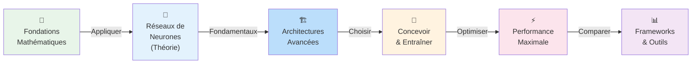

# Deep Learning & Réseaux de Neurones

Intermédiaire Expert

Le **Deep Learning** (apprentissage profond) est une branche du Machine Learning qui s'appuie sur des **réseaux de neurones artificiels** comportant de multiples couches pour apprendre des représentations de plus en plus abstraites des données. Là où le chapitre précédent introduisait les bases du ML, ce chapitre plonge au cœur des architectures neuronales : de la théorie fondamentale à la conception, l'entraînement et l'optimisation de réseaux performants.

Que tu souhaites comprendre comment fonctionne un réseau de neurones, en concevoir un de zéro, ou pousser ses performances au maximum, ce chapitre couvre l'ensemble du parcours.

---

## Parcours d'apprentissage

---

## Contenu de ce chapitre

| Page | Niveau | Description |
|------|--------|-------------|
| [Fondations mathématiques du Deep Learning](fondations-mathematiques.md) | Débutant / Intermédiaire | Probabilités, calcul vectoriel, produits matriciels, gradients et exemple pas à pas |
| [Réseaux de neurones : fondamentaux](reseaux-neurones.md) | Intermédiaire | Qu'est-ce qu'un réseau de neurones artificiel, inspiration biologique, perceptron, propagation, apprentissage |
| [Architectures de Deep Learning](architectures-deep-learning.md) | Intermédiaire / Expert | CNN, RNN, LSTM, GAN, Transformers, Autoencodeurs — panorama complet |
| [Concevoir et entraîner un réseau](concevoir-entrainer.md) | Expert | Guide pas à pas : définition du problème, choix d'architecture, hyperparamètres, entraînement, évaluation |
| [Optimisation et performance](optimisation-performance.md) | Expert | Régularisation, accélération GPU, entraînement distribué, quantification, pruning |
| [Comparaison des frameworks](comparaison.md) | Intermédiaire | TensorFlow vs PyTorch vs Keras vs JAX — critères de choix |

---

## Prérequis

!!! info "Avant de commencer"
    Ce chapitre suppose une connaissance des bases du Machine Learning couvertes au [chapitre 6](../chapitre-6-machine-learning/index.md) : types d'apprentissage (supervisé, non supervisé, par renforcement), notions de régression et classification, métriques d'évaluation.

---

## Ressources de référence

Ce chapitre s'appuie sur des sources reconnues :

- [AWS — Qu'est-ce qu'un réseau de neurones ?](https://aws.amazon.com/fr/what-is/neural-network/) — Introduction claire et visuelle
- [CNIL — Définition réseau de neurones artificiels](https://cnil.fr/fr/definition/reseau-de-neurones-artificiels-artificial-neural-network) — Définition institutionnelle française
- [OVHcloud — Qu'est-ce qu'un réseau de neurones ?](https://www.ovhcloud.com/fr/learn/what-is-neural-network/) — Vulgarisation technique
- [SAS — Réseaux de neurones](https://www.sas.com/fr_ca/insights/analytics/neural-networks.html) — Perspective analytics
- [OpenClassrooms — Initiez-vous au Deep Learning](https://openclassrooms.com/fr/courses/5801891-initiez-vous-au-deep-learning) — Cours structuré en français
- [Orange Business — Tutoriel réseau de neurones](https://perspective.orange-business.com/fr/tutoriel-machine-learning-comprendre-ce-quest-un-reseau-de-neurones-et-en-creer-un/) — Tutoriel pratique
- [IRMA / Université de Strasbourg — Scientific Machine Learning](https://irma.math.unistra.fr/~franck/cours/SciML/output/html/my-great-book.html) — Cours universitaire approfondi
- [Université de Toulouse — Réseaux de neurones](https://www.math.univ-toulouse.fr/~besse/Wikistat/pdf/st-m-app-rn.pdf) — Support académique (PDF)
