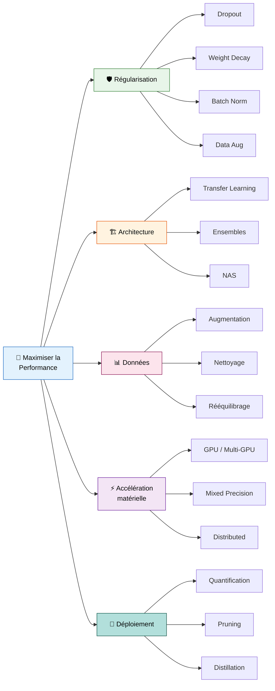
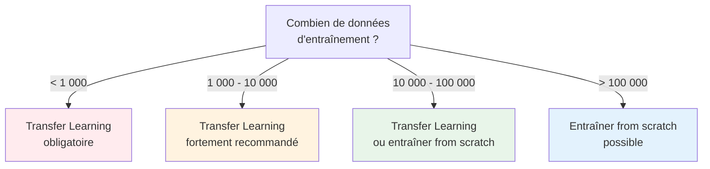
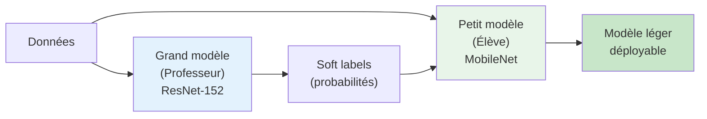

# Optimisation et Performance

<span class="badge-expert">Expert</span>

Ce guide couvre les techniques avancées pour maximiser les performances d'un réseau de neurones : régularisation, accélération matérielle, optimisation d'architecture, et mise à l'échelle. L'objectif est d'obtenir le meilleur modèle possible dans les contraintes de temps, de calcul et de données disponibles.

---

## Vue d'ensemble des leviers de performance



---

## Régularisation avancée

La régularisation empêche le modèle de **mémoriser** les données d'entraînement au lieu d'**apprendre** des motifs généralisables.

### Dropout

Le **Dropout** désactive aléatoirement une fraction des neurones à chaque itération d'entraînement, forçant le réseau à ne pas dépendre d'un seul chemin.

```python
from tensorflow.keras import layers

model.add(layers.Dense(256, activation='relu'))
model.add(layers.Dropout(0.4))  # 40% des neurones désactivés
model.add(layers.Dense(128, activation='relu'))
model.add(layers.Dropout(0.3))
```

| Taux de Dropout | Cas d'usage |
|:---------------:|-------------|
| 0.1 - 0.2 | Peu de données, réseau petit |
| 0.3 - 0.4 | **Standard** — bon compromis |
| 0.5 | Grand réseau, beaucoup de données |
| > 0.5 | Rarement utile — le réseau perd trop d'information |

### Batch Normalization

La **Batch Normalization** normalise les activations de chaque couche à moyenne ≈ 0 et variance ≈ 1, ce qui stabilise et accélère l'entraînement.

```python
# Placement recommandé : après la couche, avant l'activation (ou après)
model.add(layers.Dense(128))
model.add(layers.BatchNormalization())
model.add(layers.Activation('relu'))
model.add(layers.Dropout(0.3))
```

!!! tip "Batch Norm vs Dropout"
    En pratique, Batch Normalization et Dropout ne fonctionnent pas toujours bien ensemble. Pour les CNN modernes, beaucoup d'architectures utilisent **Batch Norm seul** (sans Dropout dans les couches convolutives) et réservent le Dropout aux couches denses finales.

### Weight Decay (L2 Regularization)

Le Weight Decay pénalise les poids trop grands en ajoutant un terme à la loss :

$$L_{total} = L_{data} + \lambda \sum w_i^2$$

```python
# Avec Keras
model.add(layers.Dense(
    128, activation='relu',
    kernel_regularizer=tf.keras.regularizers.l2(1e-4)
))

# Avec AdamW (méthode préférée)
optimizer = tf.keras.optimizers.AdamW(
    learning_rate=0.001,
    weight_decay=0.01
)
```

### Data Augmentation (images)

La **Data Augmentation** crée des variations des images d'entraînement à la volée pour augmenter artificiellement la taille du dataset :

```python
from tensorflow.keras import layers

data_augmentation = tf.keras.Sequential([
    layers.RandomFlip("horizontal"),
    layers.RandomRotation(0.1),
    layers.RandomZoom(0.1),
    layers.RandomContrast(0.1),
    layers.RandomTranslation(0.1, 0.1),
])

# Intégrer dans le modèle
model = tf.keras.Sequential([
    layers.Input(shape=(224, 224, 3)),
    data_augmentation,  # Augmentation en première couche
    layers.Conv2D(32, 3, activation='relu'),
    # ...
])
```

### Tableau récapitulatif des techniques de régularisation

| Technique | Quand l'utiliser | Impact typique |
|-----------|-----------------|:-------------:|
| **Dropout** | Toujours (couches denses) | +2-5% accuracy |
| **Batch Normalization** | Toujours (couches conv) | Entraînement 2-3× plus rapide |
| **Weight Decay** | Modèles de grande taille | Réduit l'overfitting |
| **Data Augmentation** | Peu d'images d'entraînement | +5-15% accuracy |
| **Early Stopping** | Toujours | Évite le surentraînement |
| **Label Smoothing** | Classification avec beaucoup de classes | +1-3% accuracy |

---

## Transfer Learning

Le **Transfer Learning** réutilise un modèle pré-entraîné sur un grand dataset (ex : ImageNet avec 1.2M images) et l'adapte à ta tâche spécifique. C'est **la technique la plus puissante** quand tu as peu de données.

### Quand utiliser le Transfer Learning



### Stratégies de fine-tuning

| Stratégie | Description | Quand |
|-----------|-------------|-------|
| **Feature Extraction** | Geler toutes les couches pré-entraînées, n'entraîner que le classifieur | Très peu de données, domaine similaire |
| **Fine-tuning partiel** | Dégeler les dernières couches du backbone | Données modérées |
| **Fine-tuning complet** | Tout dégeler avec un petit learning rate | Beaucoup de données, domaine différent |

### Exemple complet — Transfer Learning avec ResNet50

```python
import tensorflow as tf
from tensorflow.keras import layers, models

# 1. Charger le modèle pré-entraîné (sans la tête de classification)
base_model = tf.keras.applications.ResNet50(
    weights='imagenet',
    include_top=False,
    input_shape=(224, 224, 3)
)

# 2. Geler le backbone
base_model.trainable = False

# 3. Ajouter notre classifieur
model = models.Sequential([
    base_model,
    layers.GlobalAveragePooling2D(),
    layers.Dense(256, activation='relu'),
    layers.Dropout(0.5),
    layers.Dense(num_classes, activation='softmax')
])

# 4. Entraîner le classifieur seul (feature extraction)
model.compile(
    optimizer=tf.keras.optimizers.Adam(learning_rate=1e-3),
    loss='categorical_crossentropy',
    metrics=['accuracy']
)
model.fit(train_ds, epochs=10, validation_data=val_ds)

# 5. Fine-tuning : dégeler les 30 dernières couches
base_model.trainable = True
for layer in base_model.layers[:-30]:
    layer.trainable = False

# 6. Réentraîner avec un learning rate très faible
model.compile(
    optimizer=tf.keras.optimizers.Adam(learning_rate=1e-5),
    loss='categorical_crossentropy',
    metrics=['accuracy']
)
model.fit(train_ds, epochs=20, validation_data=val_ds)
```

!!! warning "Learning rate pour le fine-tuning"
    Lors du fine-tuning, utilise un learning rate **10 à 100× plus petit** que pour l'entraînement initial. Sinon, tu détruiras les features pré-apprises.

### Modèles pré-entraînés populaires

| Modèle | Paramètres | Top-1 Accuracy (ImageNet) | Usage recommandé |
|--------|:----------:|:-------------------------:|------------------|
| **MobileNetV3** | 5.4M | 75.2% | Mobile / Edge / Temps réel |
| **EfficientNetB0** | 5.3M | 77.1% | Bon compromis taille/performance |
| **ResNet50** | 25.6M | 76.1% | Standard, bien documenté |
| **EfficientNetB4** | 19M | 82.9% | Haute performance, GPU requis |
| **ConvNeXt** | 89M | 87.8% | État de l'art (2022+) |

---

## Accélération GPU

### Vérifier la disponibilité GPU

```python
import tensorflow as tf

# Lister les GPU disponibles
gpus = tf.config.list_physical_devices('GPU')
print(f"GPU disponibles : {len(gpus)}")
for gpu in gpus:
    print(f"  - {gpu.name}")

# Vérifier si TensorFlow utilise le GPU
print(f"Built with CUDA : {tf.test.is_built_with_cuda()}")
```

### Mixed Precision Training

Le **Mixed Precision** utilise des nombres en 16 bits (FP16) au lieu de 32 bits (FP32) pour les calculs, ce qui **double la vitesse** et **réduit la mémoire** sur les GPU modernes (NVIDIA Volta+).

```python
# Activer Mixed Precision (une seule ligne)
tf.keras.mixed_precision.set_global_policy('mixed_float16')

# Le modèle s'entraîne automatiquement en FP16
# La sortie doit rester en FP32 pour la stabilité
model.add(layers.Dense(num_classes, activation='softmax', dtype='float32'))
```

| Mode | Vitesse | Mémoire | Précision |
|------|:-------:|:-------:|:---------:|
| FP32 (défaut) | 1× | 1× | Référence |
| Mixed FP16 | **1.5-3×** | **0.5×** | ~identique |

!!! info "Prérequis"
    Le Mixed Precision nécessite un GPU NVIDIA avec Tensor Cores (architectures Volta, Turing, Ampere, Hopper — GTX 2060+, Tesla V100+).

### Entraînement multi-GPU

```python
# Stratégie de distribution (multi-GPU sur une machine)
strategy = tf.distribute.MirroredStrategy()

with strategy.scope():
    model = build_model()  # Créer le modèle dans le scope
    model.compile(optimizer='adam', loss='categorical_crossentropy')

# L'entraînement est automatiquement distribué
model.fit(train_ds, epochs=50, validation_data=val_ds)
```

| Stratégie | Description | Cas d'usage |
|-----------|-------------|-------------|
| **MirroredStrategy** | Copie le modèle sur chaque GPU, synchronise les gradients | 2-8 GPU sur une machine |
| **MultiWorkerMirrored** | Multi-GPU sur plusieurs machines | Cluster |
| **TPUStrategy** | Google Cloud TPU | Grande échelle |

---

## Optimisation pour le déploiement

### Quantification

La **quantification** réduit la précision des poids (FP32 → INT8) pour un modèle plus petit et plus rapide, avec une perte de précision minimale.

```python
import tensorflow as tf

# Quantification post-entraînement (la plus simple)
converter = tf.lite.TFLiteConverter.from_saved_model('models/mon_modele')
converter.optimizations = [tf.lite.Optimize.DEFAULT]
quantized_model = converter.convert()

# Sauvegarder le modèle quantifié
with open('models/model_quantized.tflite', 'wb') as f:
    f.write(quantized_model)
```

| Type | Taille | Vitesse | Précision |
|------|:------:|:-------:|:---------:|
| FP32 (original) | 100% | 1× | Référence |
| FP16 | 50% | 1.5× | -0.1% |
| INT8 (dynamique) | **25%** | **2-3×** | -0.5-1% |
| INT8 (full) | **25%** | **3-4×** | -1-2% |

### Pruning (élagage)

Le **Pruning** supprime les connexions (poids) les moins importantes du réseau, rendant le modèle plus compact sans perte significative de performance.

```python
import tensorflow_model_optimization as tfmot

# Appliquer le pruning progressif
pruning_schedule = tfmot.sparsity.keras.PolynomialDecay(
    initial_sparsity=0.0,
    final_sparsity=0.5,   # 50% des poids mis à zéro
    begin_step=0,
    end_step=1000
)

pruned_model = tfmot.sparsity.keras.prune_low_magnitude(
    model, pruning_schedule=pruning_schedule
)

pruned_model.compile(
    optimizer='adam',
    loss='sparse_categorical_crossentropy',
    metrics=['accuracy']
)

pruned_model.fit(
    X_train, y_train,
    epochs=10,
    callbacks=[tfmot.sparsity.keras.UpdatePruningStep()]
)

# Finaliser (supprimer les wrappers de pruning)
final_model = tfmot.sparsity.keras.strip_pruning(pruned_model)
```

### Knowledge Distillation

La **distillation** entraîne un petit modèle (l'**élève**) à reproduire les prédictions d'un grand modèle (le **professeur**).



### Comparaison des techniques d'optimisation

| Technique | Réduction taille | Impact vitesse | Perte accuracy | Difficulté |
|-----------|:----------------:|:--------------:|:--------------:|:----------:|
| **Quantification INT8** | 4× | 2-4× plus rapide | < 1% | Facile |
| **Pruning 50%** | 2× | 1.5-2× plus rapide | < 1% | Moyen |
| **Distillation** | 5-10× | 3-10× plus rapide | 1-3% | Difficile |
| **Quant + Pruning** | 6-8× | 3-6× plus rapide | 1-2% | Moyen |

---

## Checklist de performance maximale

!!! success "Checklist pour un modèle optimal"

    **Données**

    - [ ] Données nettoyées et normalisées
    - [ ] Data Augmentation (si images)
    - [ ] Classes rééquilibrées (class weights ou oversampling)

    **Architecture**

    - [ ] Transfer Learning utilisé si < 10 000 échantillons
    - [ ] Batch Normalization dans les couches convolutives
    - [ ] Dropout dans les couches denses
    - [ ] Architecture adaptée au type de données

    **Entraînement**

    - [ ] Adam comme optimiseur de départ
    - [ ] EarlyStopping avec `restore_best_weights=True`
    - [ ] ReduceLROnPlateau configuré
    - [ ] Mixed Precision activé (si GPU compatible)
    - [ ] Hyperparamètres optimisés (Keras Tuner ou Optuna)

    **Évaluation**

    - [ ] Courbes d'apprentissage analysées
    - [ ] Pas d'overfitting ni d'underfitting
    - [ ] Métriques cohérentes sur le jeu de test

    **Déploiement**

    - [ ] Quantification appliquée (si edge/mobile)
    - [ ] Pruning considéré (si contrainte de taille)
    - [ ] Format d'export adapté (ONNX, TFLite, TorchScript)

---

## Points clés à retenir

!!! success "Résumé"
    - La **régularisation** (Dropout, BatchNorm, Weight Decay, Data Augmentation) est indispensable pour généraliser
    - Le **Transfer Learning** est le levier le plus puissant quand les données sont limitées
    - Le **Mixed Precision** double la vitesse d'entraînement sur GPU modernes sans effort
    - La **quantification** et le **pruning** réduisent la taille du modèle de 4-8× pour le déploiement
    - La **distillation** permet de transférer les connaissances d'un grand modèle vers un petit
    - Optimise dans cet ordre : données → architecture → hyperparamètres → matériel → déploiement

---

## Prochaine étape

Pour choisir le bon framework et comparer leurs forces respectives, consulte la **[Comparaison des frameworks](comparaison.md)** : TensorFlow vs PyTorch vs Keras vs JAX.
