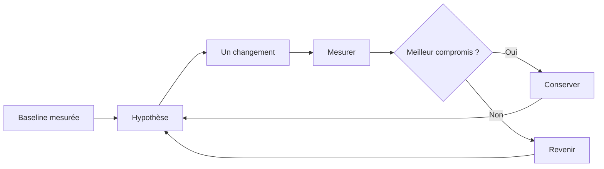

# Optimisation et performance Deep Learning

<span class="badge-expert">Expert</span>

Optimiser un modèle signifie améliorer un compromis mesuré : **qualité, temps d'entraînement, mémoire, latence, énergie et coût d'exploitation**. Cette page retire les anciens gains génériques (`+5%`, `2× plus rapide`, tailles de dropout « standard ») qui ne sont pas transférables d'un projet à l'autre.

---

## Boucle d'optimisation


```mermaid
graph LR
    B["Baseline mesurée"] --> H["Hypothèse"]
    H --> C["Un changement"]
    C --> M["Mesurer"]
    M --> D{"Meilleur compromis ?"}
    D -- Oui --> K["Conserver"]
    D -- Non --> R["Revenir"]
    K --> H
    R --> H
```

Conservez le même dataset, protocole et métriques lorsque vous comparez deux variantes.

---

## 1. Régularisation

### Dropout

Le dropout peut réduire l'overfitting dans certaines architectures, mais le taux utile dépend du modèle et des données.

```python
layers.Dropout(dropout_rate)
```

Testez plusieurs valeurs et mesurez train/validation ; ne partez pas du principe que `0.3` ou `0.5` est optimal.

### Weight decay

```python
from keras.optimizers import AdamW

optimizer = AdamW(
    learning_rate=learning_rate,
    weight_decay=weight_decay,
)
```

Le weight decay est lui aussi un hyperparamètre à valider. Sa sémantique peut varier selon l'optimizer/framework.

### Normalisation

BatchNorm, LayerNorm, RMSNorm et autres mécanismes répondent à des architectures différentes. Suivez le design établi du modèle ou les recommandations de l'architecture pré-entraînée plutôt que d'ajouter systématiquement BatchNorm.

---

## 2. Data augmentation

Une augmentation est valide si elle préserve le label et reflète une variation plausible du domaine.

Pour des images, une rotation ou un flip peut être utile — ou invalider complètement le label selon la tâche.

Mesurez :

- qualité globale ;
- qualité par sous-population ;
- calibration ;
- robustesse aux transformations réellement rencontrées.

---

## 3. Transfer learning

Le transfer learning est souvent utile lorsque vous disposez d'un modèle pré-entraîné adapté, mais il n'existe pas de seuil universel « moins de 1 000 exemples = obligatoire ».

Comparez :

```text
baseline from scratch
vs
frozen backbone + head
vs
partial/full fine-tuning
```

Avec le même split et les mêmes métriques.

Les learning rates de fine-tuning doivent suivre les recommandations du modèle/framework et être testés ; une règle fixe « 10–100× plus petit » n'est pas universelle.

---

## 4. Mixed precision

La précision mixte peut améliorer throughput et mémoire sur du matériel compatible. Le gain dépend :

- GPU/accelerator ;
- modèle ;
- tailles de batch ;
- opérations ;
- framework ;
- format numérique (FP16, BF16, etc.).

Benchmarkez :

```text
examples/sec
peak memory
validation metric
numerical stability
```

N'annoncez pas « 2× plus rapide » sans mesure locale.

---

Pour PyTorch récent, utilisez `torch.amp.autocast("cuda", dtype=torch.float16)` et, pour l’entraînement FP16, `torch.amp.GradScaler("cuda")`. Les anciennes variantes `torch.cuda.amp.*` et `torch.cpu.amp.*` sont dépréciées. BF16 et FP16 n’ont pas les mêmes besoins de scaling ; vérifiez le matériel, les opérations et les gradients. Le backward doit suivre le protocole AMP du framework, sans transformer aveuglément tous les tensors en FP16.

[PyTorch — AMP](https://docs.pytorch.org/docs/2.14/amp.html), vérifié le 3 octobre 2026. Les snippets `AdamW` de cette page utilisent Keras (`learning_rate`) ; PyTorch emploie `lr` dans `torch.optim.AdamW`.

## 5. Compilation / JIT

PyTorch, TensorFlow, JAX et les runtimes associés proposent différentes formes de compilation.

Avant activation :

1. mesurer la baseline ;
2. vérifier les opérations non supportées/dynamic shapes ;
3. mesurer warm-up vs steady-state ;
4. tester les outputs ;
5. mesurer la mémoire.

La compilation peut accélérer un workload ou ajouter de l'overhead sur un petit job.

---

## 6. Distributed training

Passez au multi-GPU/multi-node seulement si :

- un device unique ne satisfait pas le besoin ;
- le coût de communication est acceptable ;
- le pipeline de données alimente suffisamment les accélérateurs.

Mesurez le **scaling efficiency** plutôt que de supposer qu'ajouter deux fois plus de GPU divise le temps par deux.

---

## 7. Profiling

Avant d'optimiser :

- profiler compute vs data loading ;
- GPU utilization ;
- mémoire ;
- temps par étape ;
- synchronisations ;
- I/O.

Un GPU à faible utilisation peut indiquer un data loader lent plutôt qu'un modèle à optimiser.

---

## 8. Quantification

La quantification peut réduire mémoire et latence, mais la compatibilité dépend du runtime et du matériel.

Benchmarkez :

```text
model size
latency p50/p95
throughput
quality metric
unsupported ops / fallback
```

Validez toujours l'artefact dans le **runtime cible**, pas seulement dans le notebook d'export.

---

## 9. Pruning et distillation

Ces techniques peuvent être utiles pour réduire un modèle mais nécessitent un protocole clair.

### Pruning

Mesurez sparsity réelle **et** accélération effective sur le runtime ; un modèle sparse n'est pas automatiquement plus rapide.

### Distillation

Comparez student vs teacher sur :

- qualité ;
- taille ;
- latence ;
- coût d'entraînement ;
- comportement sur sous-populations critiques.

---

## 10. Choix du modèle pré-entraîné

Évitez les tables statiques de paramètres/accuracy copiées d'anciens benchmarks. Les résultats dépendent de :

- variante exacte ;
- résolution ;
- preprocessing ;
- dataset ;
- checkpoint ;
- runtime.

Consultez la model card et les benchmarks officiels de la version utilisée.

---

## 11. Benchmark de déploiement

Pour chaque candidat :

```text
hardware cible
dataset représentatif
batch size production
warmup identique
latency p50/p95/p99
throughput
peak memory
quality metric
```

Les benchmarks de laptop ou GPU de développement ne prédisent pas nécessairement la production.

---

## 12. Claude Code comme assistant d'expérimentation

```text
Nous voulons réduire la latence d'inférence.
1. exécute le benchmark baseline ;
2. profile le modèle ;
3. identifie le bottleneck principal ;
4. propose UNE optimisation compatible avec notre runtime ;
5. applique-la ;
6. réexécute le même benchmark ;
7. compare qualité, p95, throughput et mémoire.
```

Stockez les résultats dans un fichier versionné ou un système de tracking.

---

## Checklist

- [ ] baseline enregistrée ;
- [ ] bottleneck profilé ;
- [ ] une variable principale changée ;
- [ ] benchmark reproductible ;
- [ ] qualité non dégradée au-delà du seuil accepté ;
- [ ] runtime cible testé ;
- [ ] gain réel, pas théorique.

---

## Sources

- [PyTorch — Performance Tuning Guide](https://pytorch.org/tutorials/recipes/recipes/tuning_guide.html) — vérifier la version utilisée
- [TensorFlow — Performance](https://www.tensorflow.org/guide/gpu_performance_analysis) — vérifier la version utilisée
- [JAX — documentation](https://docs.jax.dev/) — vérifier la version utilisée
- [Keras — guides](https://keras.io/guides/) — vérifier la version utilisée

## Prochaine étape

Poursuivez avec **[Comparaison des Frameworks](comparaison.md)**, la page suivante dans le menu.
