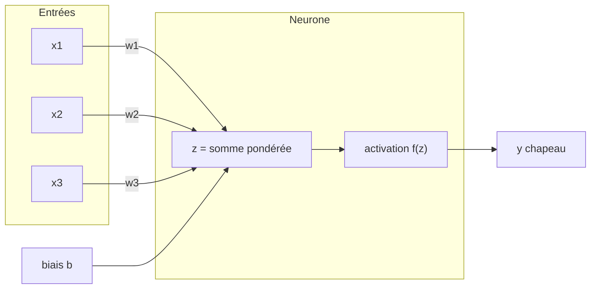
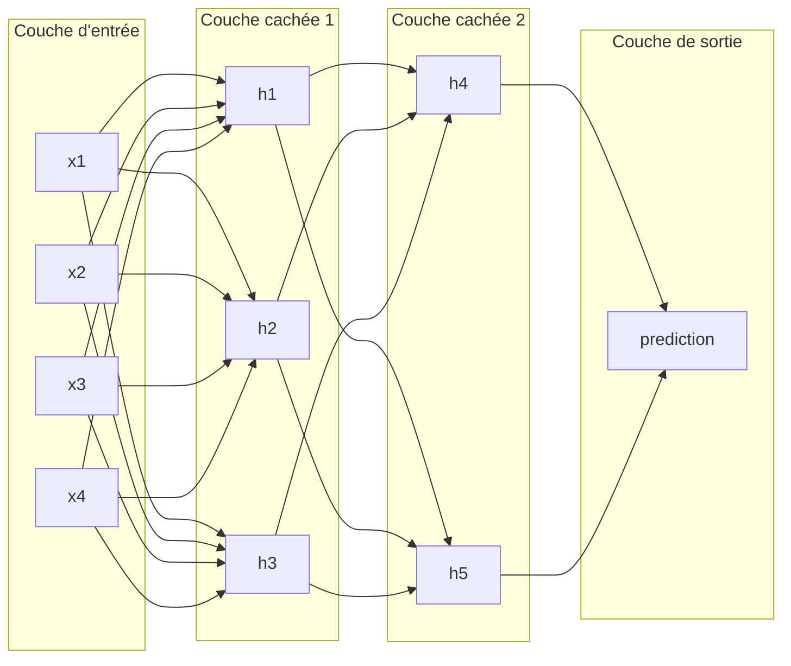

# Réseaux de Neurones : Fondamentaux

<span class="badge-intermediate">Intermédiaire</span>

Ce guide explique le fonctionnement des réseaux de neurones artificiels (RNA),
avec des formules lisibles, des acronymes explicités, des exemples concrets et
des liens vers les documentations officielles associées.

---

## Acronymes et notations (à lire avant les formules)

### Acronymes

| Acronyme | Signification | Explication rapide |
|----------|---------------|--------------------|
| **RNA / ANN** | Réseau de Neurones Artificiels / Artificial Neural Network | Modèle composé de neurones artificiels organisés en couches |
| **ML** | Machine Learning | Apprentissage automatique à partir de données |
| **DL** | Deep Learning | Sous-domaine du ML avec réseaux profonds |
| **MSE** | Mean Squared Error | Erreur quadratique moyenne (régression) |
| **BCE** | Binary Cross-Entropy | Perte pour classification binaire |
| **CCE** | Categorical Cross-Entropy | Perte pour classification multiclasse |
| **GD** | Gradient Descent | Descente de gradient |
| **SGD** | Stochastic Gradient Descent | Descente de gradient stochastique |
| **RNN** | Recurrent Neural Network | Réseau récurrent pour séquences |
| **CNN** | Convolutional Neural Network | Réseau convolutionnel pour images |

### Symboles mathématiques

| Symbole | Lecture | Signification |
|---------|---------|---------------|
| $x_i$ | "x indice i" | i-e feature en entrée |
| $w_i$ | "w indice i" | poids associé à $x_i$ |
| $b$ | "b" | biais |
| $z$ | "z" | somme pondérée avant activation |
| $\hat{y}$ | "y chapeau" | prédiction du modèle |
| $y$ | "y" | valeur réelle (label) |
| $L$ | "L" | fonction de perte |
| $\eta$ | "eta" | learning rate (pas d'apprentissage) |
| $\partial$ | "dérivée partielle" | variation locale d'une fonction |
| $\sum$ | "somme" | addition sur un ensemble d'indices |

!!! info "Comment lire une formule"
    Lis de gauche à droite :
    1. ce que l'on veut calculer,
    2. avec quelles opérations,
    3. et quels paramètres sont appris pendant l'entraînement.

---

## Qu'est-ce qu'un réseau de neurones artificiel ?

Un **réseau de neurones artificiels** est un modèle inspiré du cerveau humain.
Il prend des entrées numériques, applique des transformations successives dans
des couches de neurones, puis produit une prédiction.

### Neurone artificiel (perceptron)

Le neurone est l'unité de base d'un réseau.



Formule du neurone :

$$
z = \sum_{i=1}^{n} w_i x_i + b
$$

Symboles utilisés ici :

- $z$ : somme pondérée avant activation.
- $x_i$ : i-e entrée (feature).
- $w_i$ : poids appris pour l'entrée $x_i$.
- $b$ : biais.
- $n$ : nombre total d'entrées.

$$
\hat{y} = f(z)
$$

Symboles utilisés ici :

- $\hat{y}$ : sortie prédite.
- $f(\cdot)$ : fonction d'activation.
- $z$ : valeur calculée à la formule précédente.

Exemple concret : si $x=[2,1]$, $w=[0.5,-1]$, $b=0.2$ alors

$$
z = 0.5 \cdot 2 + (-1) \cdot 1 + 0.2 = 0.2
$$

Puis la sortie dépend de l'activation choisie.

!!! tip "Rôle du biais"
    Sans biais, le neurone est trop contraint. Le biais déplace la frontière de
    décision et améliore la capacité d'ajustement.

---

## Fonctions d'activation : explication concrète

La fonction d'activation transforme $z$ en sortie utile. Elle ajoute de la
non-linéarité, indispensable pour apprendre des motifs complexes.

### Vue d'ensemble

| Fonction | Formule | Plage de sortie | Quand l'utiliser |
|----------|---------|-----------------|------------------|
| Sigmoid | $\sigma(x)=\frac{1}{1+e^{-x}}$ | $(0,1)$ | Sortie binaire |
| Tanh | $\tanh(x)=\frac{e^x-e^{-x}}{e^x+e^{-x}}$ | $(-1,1)$ | Couches cachées (moins courant aujourd'hui) |
| ReLU | $\text{ReLU}(x)=\max(0,x)$ | $[0,+\infty)$ | Standard en couche cachée |
| Leaky ReLU | $\max(\alpha x,x)$ | $(-\infty,+\infty)$ | Quand ReLU "meurt" |
| Softmax | $\text{softmax}(x_i)=\frac{e^{x_i}}{\sum_j e^{x_j}}$ | $(0,1)$ et somme $=1$ | Sortie multiclasse |

### Sigmoid

$$
\sigma(x)=\frac{1}{1+e^{-x}}
$$

Symboles utilisés ici :

- $x$ : score d'entrée du neurone.
- $e$ : constante d'Euler (environ 2.71828).
- $\sigma(x)$ : probabilité de sortie entre 0 et 1.

- Intuition : convertit un score en probabilité.
- Exemple : pour $x=0$, $\sigma(0)=0.5$.
- Limite : saturation pour grandes valeurs absolues, gradient faible.

### Tanh

$$
\tanh(x)=\frac{e^x-e^{-x}}{e^x+e^{-x}}
$$

Symboles utilisés ici :

- $x$ : score d'entrée.
- $e$ : constante d'Euler.
- $\tanh(x)$ : sortie centrée entre -1 et 1.

- Intuition : similaire à Sigmoid mais centrée autour de 0.
- Exemple : $\tanh(0)=0$, $\tanh(2)\approx0.964$.
- Limite : peut aussi saturer.

### ReLU

$$
\text{ReLU}(x)=\max(0,x)
$$

Symboles utilisés ici :

- $x$ : score d'entrée.
- $\max(0,x)$ : retourne la plus grande valeur entre 0 et $x$.

- Intuition : coupe les valeurs négatives, laisse passer les positives.
- Exemple : ReLU(-3)=0, ReLU(2.5)=2.5.
- Avantage : simple, rapide, efficace en pratique.

### Leaky ReLU

$$
\text{LeakyReLU}(x)=\max(\alpha x,x),\; \alpha \approx 0.01
$$

Symboles utilisés ici :

- $x$ : score d'entrée.
- $\alpha$ : petite pente appliquée si $x<0$.

- Intuition : version ReLU qui garde une petite pente côté négatif.
- Exemple : avec $\alpha=0.01$, LeakyReLU(-3)=-0.03.
- Avantage : réduit les neurones bloqués à 0.

### Softmax

$$
\text{softmax}(x_i)=\frac{e^{x_i}}{\sum_{j=1}^{K} e^{x_j}}
$$

Symboles utilisés ici :

- $x_i$ : score de la classe $i$.
- $K$ : nombre total de classes.
- $\sum_{j=1}^{K}$ : somme sur toutes les classes.
- sortie : probabilité de la classe $i$.

- Intuition : transforme un vecteur de scores en distribution de probabilités.
- Exemple : scores [2.0, 1.0, 0.1] deviennent environ [0.66, 0.24, 0.10].
- Usage : dernière couche d'une classification à $K$ classes.

!!! warning "Pourquoi ReLU est souvent le choix par défaut"
    Sigmoid et Tanh saturent plus facilement, ce qui ralentit l'apprentissage
    dans les réseaux profonds (gradient qui disparaît). ReLU est en général plus
    stable et plus rapide à entraîner.

---

## Architecture d'un réseau multicouche



| Couche | Rôle | Exemple |
|--------|------|---------|
| Entrée | Reçoit les features | taille = nombre de variables |
| Cachée | Extrait des motifs | combinaisons non linéaires |
| Sortie | Produit la prédiction | 1 neurone (binaire) ou K (multiclasse) |

---

## Comment le réseau apprend : rétropropagation

Cycle d'entraînement :

1. **Forward pass** : calcul de $\hat{y}$
2. **Calcul de la loss** : mesure de l'erreur
3. **Backpropagation** : calcul des gradients
4. **Mise à jour** : ajustement des poids

### Fonctions de perte courantes

#### MSE (régression)

$$
L = \frac{1}{n} \sum_{i=1}^{n} (y_i-\hat{y}_i)^2
$$

Symboles utilisés ici :

- $L$ : valeur de la perte.
- $n$ : nombre d'exemples.
- $y_i$ : valeur réelle de l'exemple $i$.
- $\hat{y}_i$ : prédiction du modèle pour l'exemple $i$.

Lecture : on fait la moyenne des carrés des écarts prédiction-réalité.

#### BCE (classification binaire)

$$
L = -\left[y\log(\hat{y}) + (1-y)\log(1-\hat{y})\right]
$$

Symboles utilisés ici :

- $y \in \{0,1\}$ : classe réelle.
- $\hat{y} \in (0,1)$ : probabilité prédite pour la classe positive.
- $\log$ : logarithme naturel.

Lecture : forte pénalité quand le modèle est très confiant et faux.

#### CCE (classification multiclasse)

$$
L = -\sum_{i=1}^{K} y_i \log(\hat{y}_i)
$$

Symboles utilisés ici :

- $K$ : nombre de classes.
- $y_i$ : composante réelle (souvent one-hot) de la classe $i$.
- $\hat{y}_i$ : probabilité prédite pour la classe $i$.

Lecture : compare distribution vraie (souvent one-hot) et distribution prédite.

### Règle de la chaîne (idée clé)

$$
\frac{\partial L}{\partial w_i}
=
\frac{\partial L}{\partial \hat{y}}
\cdot
\frac{\partial \hat{y}}{\partial z}
\cdot
\frac{\partial z}{\partial w_i}
$$

Symboles utilisés ici :

- $\frac{\partial L}{\partial w_i}$ : effet du poids $w_i$ sur la perte.
- $\frac{\partial L}{\partial \hat{y}}$ : effet de la prédiction sur la perte.
- $\frac{\partial \hat{y}}{\partial z}$ : effet de $z$ sur la prédiction.
- $\frac{\partial z}{\partial w_i}$ : effet de $w_i$ sur $z$.

Lecture : impact d'un poids sur la perte = produit d'impacts intermédiaires.

### Mise à jour des poids

$$
w \leftarrow w - \eta \frac{\partial L}{\partial w}
$$

Symboles utilisés ici :

- $w$ : paramètre avant mise à jour.
- $\eta$ : learning rate (taille du pas).
- $\frac{\partial L}{\partial w}$ : gradient de la perte par rapport à $w$.

Si $\eta$ est trop grand, l'entraînement diverge. S'il est trop petit,
l'apprentissage devient très lent.

---

## Descente de gradient et optimiseurs

| Variante | Principe | Usage |
|----------|----------|-------|
| Batch GD | Gradient sur tout le dataset | Stable mais coûteux |
| SGD | Gradient sur un échantillon | Rapide mais bruité |
| Mini-batch GD | Gradient sur un lot (ex. 32, 64) | Compromis standard |

| Optimiseur | Idée | Recommandation |
|------------|------|----------------|
| SGD + Momentum | Ajoute une inertie | Bon baseline |
| RMSprop | Adapte le pas par paramètre | Souvent utile en séquentiel |
| Adam | Momentum + adaptation | Choix de départ courant |
| AdamW | Adam + weight decay découplé | Souvent préférable pour grands modèles |

---

## Exemple pratique : réseau simple en Python

```python
from sklearn.datasets import load_iris
from sklearn.model_selection import train_test_split
from sklearn.preprocessing import StandardScaler
from tensorflow import keras
from tensorflow.keras import layers

# 1) Donnees
iris = load_iris()
X, y = iris.data, iris.target

X_train, X_test, y_train, y_test = train_test_split(
    X, y, test_size=0.2, random_state=42
)

scaler = StandardScaler()
X_train = scaler.fit_transform(X_train)
X_test = scaler.transform(X_test)

# 2) Modele
model = keras.Sequential([
    layers.Input(shape=(4,)),
    layers.Dense(16, activation="relu"),
    layers.Dense(8, activation="relu"),
    layers.Dense(3, activation="softmax"),
])

# 3) Compilation
model.compile(
    optimizer="adam",
    loss="sparse_categorical_crossentropy",
    metrics=["accuracy"],
)

# 4) Entrainement
model.fit(X_train, y_train, epochs=50, batch_size=16, validation_split=0.2)

# 5) Evaluation
test_loss, test_acc = model.evaluate(X_test, y_test)
print(f"Precision test: {test_acc:.2%}")
```

!!! example "Ce que fait ce code"
    - 4 entrées numériques par fleur.
    - 2 couches cachées avec ReLU.
    - 3 sorties avec Softmax pour 3 classes.
    - Optimiseur Adam et loss catégorielle sparse.

---

## Références officielles des formules

Le tableau ci-dessous relie chaque formule importante à une documentation
officielle (framework ou référence mathématique standard).

| Formule / concept | Référence officielle |
|-------------------|----------------------|
| Sigmoid $\sigma(x)=\frac{1}{1+e^{-x}}$ | [PyTorch - torch.nn.Sigmoid](https://pytorch.org/docs/stable/generated/torch.nn.Sigmoid.html) |
| Tanh | [PyTorch - torch.nn.Tanh](https://pytorch.org/docs/stable/generated/torch.nn.Tanh.html) |
| ReLU | [PyTorch - torch.nn.ReLU](https://pytorch.org/docs/stable/generated/torch.nn.ReLU.html) |
| Leaky ReLU | [PyTorch - torch.nn.LeakyReLU](https://pytorch.org/docs/stable/generated/torch.nn.LeakyReLU.html) |
| Softmax | [PyTorch - torch.nn.Softmax](https://pytorch.org/docs/stable/generated/torch.nn.Softmax.html) |
| MSE | [TensorFlow - tf.keras.losses.MeanSquaredError](https://www.tensorflow.org/api_docs/python/tf/keras/losses/MeanSquaredError) |
| BCE | [TensorFlow - tf.keras.losses.BinaryCrossentropy](https://www.tensorflow.org/api_docs/python/tf/keras/losses/BinaryCrossentropy) |
| CCE | [TensorFlow - tf.keras.losses.CategoricalCrossentropy](https://www.tensorflow.org/api_docs/python/tf/keras/losses/CategoricalCrossentropy) |
| Descente de gradient / SGD | [PyTorch - torch.optim.SGD](https://pytorch.org/docs/stable/generated/torch.optim.SGD.html) |
| Adam | [PyTorch - torch.optim.Adam](https://pytorch.org/docs/stable/generated/torch.optim.Adam.html) |
| AdamW | [PyTorch - torch.optim.AdamW](https://pytorch.org/docs/stable/generated/torch.optim.AdamW.html) |
| Règle de la chaîne | [Wolfram MathWorld - Chain Rule](https://mathworld.wolfram.com/ChainRule.html) |
| Standardisation des features (exemple) | [scikit-learn - StandardScaler](https://scikit-learn.org/stable/modules/generated/sklearn.preprocessing.StandardScaler.html) |

!!! info "Pourquoi des liens de frameworks ?"
    Les docs de PyTorch et TensorFlow donnent les implémentations exactes
    utilisées en pratique (API, comportement numérique, options), ce qui est
    généralement plus utile en développement qu'une formule isolée.

---

## Points clés à retenir

!!! success "Résumé"
    - Les acronymes et symboles doivent être maîtrisés avant de lire les équations.
    - Un neurone calcule une somme pondérée puis applique une activation.
    - ReLU est souvent le meilleur choix de départ en couche cachée.
    - Le couple Softmax + CCE est standard en multiclasse.
    - L'apprentissage repose sur backpropagation + descente de gradient.
    - Les références officielles permettent de valider chaque formule en contexte réel.

---

## Prochaine étape

**[Architectures spécialisées du Deep Learning](architectures-deep-learning.md)** : comparer CNN, RNN et Transformers, comprendre leurs cas d'usage, leurs forces et leurs limites.

Concepts clés couverts :

- **CNN** - extraction locale de motifs pour images
- **RNN** - traitement de séquences et dépendances temporelles
- **Transformers** - attention et parallélisation à grande échelle
- **Choix d'architecture** - aligner le modèle avec le type de données
