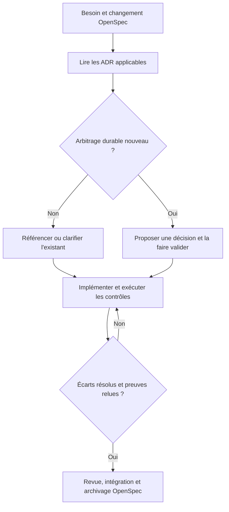

# Gérer les ADR avec Claude Code, OpenSpec et arc42

<span class="badge-intermediate">Intermédiaire</span> <span class="badge-expert">Expert</span>

Un **Architecture Decision Record (ADR)** conserve une décision importante, ses raisons et ses compromis. L'objectif est de retrouver les décisions utiles et de vérifier leur application, avec un corpus assez court pour rester lisible.

Cette page propose une **politique de projet** pour améliorer les ADR existants et formaliser les prochains. Le filtre de pertinence et la validation humaine décrits ici sont des conventions à mettre en place : ils ne sont pas garantis automatiquement par les outils.

## Répartir les responsabilités

| Élément | Responsabilité | Ce qu'il faut éviter |
|---|---|---|
| [OpenSpec](../chapitre-13-outils-economies/openspec.md) déjà installé | Spécifier et suivre le changement : besoins, conception, tâches | Produire un ADR pour chaque tâche |
| arc42 | Décrire l’architecture globale et ses vues | Recopier tous les ADR dans le dossier |
| Registre d'ADR | Conserver les arbitrages durables et leur historique | Copier la même décision dans plusieurs registres |
| Claude Code | Examiner l'existant, proposer, rédiger et revoir le code | Inventer les raisons historiques d'une implémentation |
| [Archgate CLI](../chapitre-13-outils-economies/archgate.md) | Exécuter les contrôles associés aux décisions | Confondre absence de violation et couverture complète |
| Tests du projet, dont ArchUnit en Java | Vérifier les contraintes avec l'outil adapté | Réimplémenter chaque test dans plusieurs outils |

Le combo repose sur les fichiers Git et les commandes du projet. Il ne suppose pas l'existence d'un connecteur natif OpenSpec–Archgate.

## Articuler arc42, OpenSpec et le registre ADR

**arc42 reste le dossier d'architecture de référence.** Sa section 9 traite des décisions importantes et recommande d'éviter les textes redondants. Cela rejoint le filtre de pertinence : toutes les modifications n'ont pas vocation à devenir une décision architecturale.

Pour un projet qui utilise déjà arc42, nous proposons une section 9 servant d'index vers les ADR canoniques : identifiant, titre, statut et lien. Le registre peut rester à son emplacement actuel tant que la migration vers Archgate n'est pas décidée. Après migration, cet index pointe vers `.archgate/adrs/` ; il ne devient pas un second registre éditable.

### Mettre à jour les vues concernées

La table suivante est une proposition de correspondance pour la revue d'un changement, à adapter au dossier existant :

| Impact du changement | Sections arc42 à examiner |
|---|---|
| Frontières du système ou intégrations externes | 3 — Contexte et périmètre |
| Stratégie générale de la solution | 4 — Stratégie de solution |
| Modules, responsabilités, dépendances | 5 — Vue des blocs |
| Scénarios et échanges à l'exécution | 6 — Vue d'exécution |
| Infrastructure et topologie | 7 — Vue de déploiement |
| Concept transversal, par exemple sécurité | 8 — Concepts transversaux |
| Nouvelle décision ou remplacement | 9 — Décisions architecturales : index et liens |
| Objectif mesurable ou scénario de qualité | 10 — Exigences de qualité |
| Écart accepté, risque ou dette | 11 — Risques et dette technique |

Ne pas réécrire les douze sections à chaque tâche. Dans la revue OpenSpec, noter les sections affectées ou l'absence d'impact documentaire. Une mise à jour d'une vue arc42 peut être nécessaire sans justifier un nouvel ADR.

### Exemple : isoler les adaptateurs de stockage

- **OpenSpec** décrit le changement, ses critères d'acceptation et ses tâches.
- **L'ADR** explique l'arbitrage durable sur les dépendances autorisées ; s'il existe déjà, le référencer.
- **arc42 §5** montre les modules et leurs relations ; **§9** renvoie à la décision.
- **ArchUnit ou les règles appropriées** vérifient les dépendances ; l'ADR référence les preuves.
- **arc42 §11** consigne les écarts restant à traiter, avec un lien vers leur suivi.

Avant d'archiver le changement OpenSpec, vérifier que code, ADR et vues arc42 décrivent une situation cohérente, en distinguant clairement l'existant de la cible. Si le dossier est exporté en HTML ou DOCX, vérifier les liens vers les ADR ; toute inclusion de leur texte doit être générée depuis le registre canonique.

## Décider si un ADR est pertinent

Avant toute création, répondre à trois questions :

1. Quelle décision durable doit être mémorisée, et pourquoi ?
2. Quel impact, compromis ou coût de retour arrière justifie cette formalisation ?
3. Pourquoi les ADR existants ne couvrent-ils pas déjà ce choix ?

Une réponse vague conduit à demander une précision ou à documenter ailleurs. Un ADR doit porter **une décision cohérente** ; il peut gouverner plusieurs modules et plusieurs contrôles.

| Exemple | Destination recommandée |
|---|---|
| Isoler le domaine des adaptateurs de stockage | ADR : frontière structurelle durable |
| Choisir une garantie de livraison des événements | ADR : compromis de fiabilité |
| Changer de moteur de persistance | ADR si arbitrage et migration significatifs |
| Ajouter une classe conforme à une architecture déjà décidée | Code et tâche OpenSpec ; citer l'ADR existant |
| Corriger une requête incorrecte | Issue, test et changement OpenSpec si nécessaire |
| Fixer indentation et nommage local | Linter ou guide de développement |
| Décrire les endpoints existants | Documentation technique |

**Pas de quota artificiel**, mais pas d'ADR automatique à chaque fonctionnalité, PR ou session. Une convention mineure reste une convention, même si Archgate permet techniquement de la représenter sous forme d'ADR. Ne pas importer un catalogue de décisions qui n'ont pas été prises par l'équipe.

## Assainir les ADR existants

Commencer par un audit en lecture seule, couvrant tous les emplacements d'ADR et tous les modules applicables. Produire un tableau avec : identifiant, statut déclaré, périmètre, preuves dans le dépôt, doublons, contradictions, contrôles existants et action proposée.

| Action | Quand l'utiliser |
|---|---|
| Conserver | Décision utile, compréhensible et toujours applicable |
| Clarifier | Contexte ou conséquences incomplets, sans changer le choix |
| Regrouper | Brouillons redondants portant réellement la même décision |
| Remplacer | Nouvelle décision incompatible avec une décision acceptée |
| Reclasser | Tâche, tutoriel ou convention locale présentée comme ADR |
| Faire confirmer | Raison historique ou statut impossibles à établir |

Conserver les identifiants et les liens historiques. Pour un ADR accepté, ne pas réécrire silencieusement la décision pour la faire correspondre au code. Un écart peut être une dette à corriger, une exception à encadrer ou un remplacement à faire valider. Relier ancien et nouveau documents ; laisser une trace lorsqu'un document est reclassé. Les brouillons peuvent être simplifiés avant acceptation.

Le code prouve une implémentation, pas l'intention de ses auteurs. Étiqueter les hypothèses et les questions ouvertes au lieu de fabriquer des alternatives prétendument étudiées.

## Format court et vérifiable

Viser une page lisible pour une décision ordinaire, avec des liens vers les études plus longues. La longueur est un objectif éditorial, pas une limite bloquante.

| Rubrique | Contenu attendu |
|---|---|
| Identité | Identifiant stable, titre, statut, date, responsables |
| Contexte | Problème concret et contraintes déterminantes |
| Décision | Choix, périmètre et limites |
| Alternatives | Options réellement envisagées et raisons du choix |
| Conséquences | Bénéfices, coûts et compromis acceptés |
| Vérification | Test, règle, commande ou revue manuelle ; couverture restante |
| Traçabilité | Changement OpenSpec, PR, ADR remplacé et exceptions |

Avec Archgate, conserver les métadonnées et les intitulés techniques attendus par son modèle ; rédiger le contenu explicatif en français. Voir le [guide de configuration](../chapitre-13-outils-economies/archgate.md).

## Combiner avec une installation OpenSpec existante

**Ne pas réinstaller ni réinitialiser OpenSpec pour ajouter cette discipline.** Examiner d'abord la version, la configuration, les schémas et les changements en cours dans l'application.

### Un registre unique

Pour un pilote Archgate, nous recommandons de rendre `.archgate/adrs/` canonique après une migration relue des ADR retenus. Adapter leurs métadonnées au schéma de l'outil et maintenir une correspondance avec les anciens identifiants et chemins. Si la migration n'est pas encore validée, garder le registre existant et utiliser les tests actuels ; ne pas annoncer une couverture Archgate qui n'est pas configurée.

Les artefacts OpenSpec contiennent un **lien vers la décision canonique** et expliquent son impact sur le changement. Ils n'en maintiennent pas une seconde copie. L'archivage d'un changement doit laisser les ADR durables accessibles et les liens valides.

### Conserver d'abord le schéma actuel

Le parcours le plus léger consiste à conserver le schéma OpenSpec existant et à ajouter une étape « impact architectural » à la revue de conception :

- aucun arbitrage durable : expliquer brièvement « aucun nouvel ADR nécessaire » dans le design ou la revue ;
- décision déjà couverte : citer l'ADR ;
- clarification : améliorer l'ADR sans modifier son sens ;
- nouvelle décision ou remplacement : proposer un ADR, puis obtenir son acceptation avant l'implémentation qui en dépend.

Les [schémas personnalisés](../chapitre-13-outils-economies/openspec-schemas.md) constituent une évolution facultative. Si un schéma impose un artefact ADR à chaque changement, adapter et valider un schéma local pour permettre une conclusion sans nouvel ADR ; ne pas détourner le registre en y créant des décisions vides. Ne pas modifier les fichiers globaux installés par npm ni migrer les changements en cours sans revue.

### Boucle de travail



Les commandes `/opsx:...` se lancent dans l'agent ; les commandes `archgate ...` dans le terminal. Utiliser les commandes OpenSpec réellement disponibles dans le profil installé, détaillées sur sa [fiche](../chapitre-13-outils-economies/openspec.md#workflow-principal).

## Contrôler le respect dans le code

Pour chaque ADR accepté, distinguer ce qui est automatisé, partiellement couvert et manuel. Une seule décision sur l'isolation du domaine peut nécessiter plusieurs tests ; cela ne justifie pas plusieurs ADR.

| Contrainte | Preuve proposée |
|---|---|
| Dépendances interdites entre couches Java | Test ArchUnit portant l'identifiant de l'ADR |
| Absence de cycles entre modules Java | Test ArchUnit sur tous les modules concernés |
| Présence d'un fichier ou d'une configuration | Règle Archgate adaptée |
| Livraison d'événements et gestion des reprises | Tests d'intégration et scénarios d'échec |
| Compromis métier ou choix de fournisseur | Revue humaine et critères documentés |

ArchUnit vérifie notamment dépendances, couches et cycles à partir du bytecode Java. Pour un dépôt multi-module, vérifier explicitement les classes importées et les modules construits : un test vert sur un sous-ensemble ne prouve pas la conformité de toute l'application.

Faire échouer la CI sur les contrôles convenus. Tester chaque nouvelle règle avec au moins un cas conforme et une violation représentative. Une règle jamais déclenchée peut simplement viser le mauvais périmètre. Un ADR non automatisable reste pertinent si son mode de revue est explicite.

## Consignes à intégrer au projet

Ajouter un lien vers la politique ADR dans `CLAUDE.md`, avec des consignes courtes adaptées au registre choisi :

```markdown
## Décisions d'architecture
- Avant de modifier une frontière architecturale, lire les ADR applicables.
- Réutiliser une décision existante avant d'en proposer une nouvelle.
- Justifier la pertinence de tout nouvel ADR : impact durable, arbitrage, absence de doublon.
- Ne pas transformer une tâche ou une convention mineure en ADR.
- Ne pas inventer les raisons historiques des décisions.
- Faire valider une nouvelle décision ou un remplacement avant acceptation.
- Relier le changement OpenSpec à l'ADR canonique, sans recopier son contenu.
- Mettre à jour les vues arc42 affectées et son index des décisions en section 9.
- Exécuter les contrôles documentés et déclarer ce qui reste non vérifié.
```

Cette consigne oriente Claude ; les tests et la revue constituent les contrôles effectifs. Garder les procédures d'audit détaillées dans la documentation ou un skill à la demande plutôt que charger tout le corpus à chaque session.

## Critères de réussite du pilote

- Les ADR actifs ont un périmètre et un statut compréhensibles.
- Chaque nouvel ADR passe le filtre de pertinence ; un changement peut n'en créer aucun.
- Aucun doublon entre OpenSpec, arc42 et le registre canonique.
- Les vues arc42 affectées et les liens de sa section 9 sont à jour.
- Les contraintes automatisables ont des contrôles exécutés et un périmètre connu.
- Les écarts existants restent visibles ; aucune règle n'est affaiblie pour faire passer le code.
- Les liens historiques restent utilisables après migration et archivage.

---

## Prochaine étape

Poursuivez avec **[OpenSpec](openspec.md)**, la page suivante dans le menu.

## Sources

Sources officielles consultées le **10 octobre 2026**. Les critères de pertinence et le workflow combiné sont les recommandations de cette documentation.

- [arc42 — structure du dossier](https://arc42.org/overview/)
- [arc42 — section 9, décisions architecturales](https://docs.arc42.org/section-9/)
- [OpenSpec — dépôt officiel](https://github.com/Fission-AI/OpenSpec)
- [Archgate — rédaction des ADR](https://cli.archgate.dev/guides/writing-adrs/)
- [Archgate — schéma des ADR](https://cli.archgate.dev/reference/adr-schema/)
- [ArchUnit — capacités et fonctionnement](https://www.archunit.org/)
