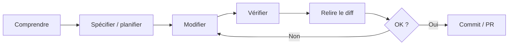

# Bonnes pratiques avec Claude Code

Claude Code est plus utile lorsqu'il reçoit un dépôt lisible, un objectif vérifiable et la possibilité d'exécuter les contrôles du projet. Ce chapitre regroupe les pratiques qui améliorent la qualité **sans augmenter inutilement l'autonomie ou le contexte**.


---

## Les principes qui comptent le plus

| Principe | Application |
|---|---|
| **Contexte ciblé** | `CLAUDE.md` court, rules avec `paths` ciblées et skills à la demande |
| **Spec/plan avant gros changement** | clarifier le besoin et les critères avant d'éditer plusieurs fichiers |
| **Ground truth** | exécuter tests, build, lint, benchmarks et commandes réelles |
| **Petits diffs** | une hypothèse ou responsabilité par changement |
| **Outils minimaux** | ne donner à un agent que les capacités nécessaires |
| **Relecture du diff** | l'agent produit, le développeur reste responsable du commit |
| **Sécurité** | protéger secrets, permissions, données et systèmes externes |
| **Contexte propre** | `/clear` entre tâches indépendantes, compaction si nécessaire |

---

## Pages du chapitre

<div class="grid cards" markdown>

- :material-comment-text: **[Utilisation effective](utilisation-effective.md)**

    Choisir entre conversation, Plan, skills, subagents, MCP et vérification.

- :material-code-tags: **[Organisation du code](organisation-code.md)**

    Structurer le dépôt pour qu'un agent puisse comprendre et valider les changements.

- :material-file-document-check: **[ADR avec Claude Code, OpenSpec et arc42](adr-claude.md)**

    Améliorer les décisions existantes, filtrer les nouvelles et vérifier leur respect avec Archgate CLI et les tests du projet.

- :material-file-document-edit: **[OpenSpec — spec-driven development](../chapitre-13-outils-economies/openspec.md)**

    Formaliser proposal, specs, design et tasks avant implémentation, avec des artefacts versionnés dans Git.

- :material-file-tree: **[OpenSpec Custom Schemas](../chapitre-13-outils-economies/openspec-schemas.md)**

    Étendre OpenSpec avec des workflows behaviour-driven, intent-driven, event-driven, ADR ou minimalist.

- :material-lightning-bolt: **[Productivité](productivite.md)**

    Réduire les allers-retours, garder le contexte utile et automatiser les tâches répétitives.

- :material-shield-check: **[Sécurité & Qualité](securite-qualite.md)**

    Relecture, hallucinations, dépendances, secrets, permissions et contrôles avant commit.

- :material-speedometer: **[Performance & Ressources](performance.md)**

    Contexte, coûts, outils externes et impact des sessions longues.

- :material-routes: **[Workflows IA complets](workflows-ia.md)**

    PRD/spec → plan → implémentation → tests → review, TDD, debugging et refactoring.

</div>

---

## Quand utiliser une spec versionnée ?

Une conversation ou un plan de session suffit souvent pour une correction locale. Une spec versionnée devient plus intéressante lorsque :

- plusieurs fichiers, services ou repos sont concernés ;
- les critères métier doivent survivre à la session ;
- plusieurs développeurs ou agents doivent partager la même intention ;
- le changement implique une décision d'architecture ;
- la PR doit expliquer clairement pourquoi et quoi modifier avant le comment.

**[OpenSpec](../chapitre-13-outils-economies/openspec.md)** est un exemple de framework qui structure cette discipline. Il reste optionnel : le principe important est d'adapter le niveau de formalisation au risque et à la durée de vie du changement.

---

## Un bon agent a besoin d'un bon environnement

Avant de perfectionner vos prompts, vérifiez que le dépôt fournit :

- commandes build/test/lint documentées ;
- architecture lisible ;
- conventions versionnées ;
- tests exécutables ;
- petits jeux de données ou fixtures pour reproduire les erreurs ;
- absence de secrets dans les fichiers accessibles inutilement.

Claude peut alors récupérer du **ground truth** depuis l'environnement plutôt que de produire une réponse uniquement plausible.

---

## `CLAUDE.md` : moins mais mieux

Gardez-y les informations valables pour presque toutes les sessions :

```markdown
# Project

## Commands
- Test: `pytest -q`
- Lint: `ruff check .`
- Build: `mkdocs build --strict`

## Rules
- Keep changes scoped.
- Run relevant tests before finishing.
- Never commit secrets.
- Preserve existing public behavior unless the task says otherwise.
```

Les procédures longues vont dans des **skills** ; les règles ciblées dans `.claude/rules/` ; les explorations lourdes dans des **subagents** ; les exigences spécifiques d'un changement peuvent vivre dans un framework de spec comme OpenSpec lorsque cela se justifie.

---

## Boucle de travail recommandée



Cette boucle est plus importante qu'un « prompt parfait ».

---

## Sources

- [Claude Code — bonnes pratiques actuelles](https://code.claude.com/docs/en/best-practices) — vérifié le 2026-10-03
- [Claude Code — chargement des rules](https://code.claude.com/docs/en/memory) — vérifié le 2026-10-03

- [Claude Code — répertoire `.claude/`](https://code.claude.com/docs/en/claude-directory) — consulté le 2026-09-28
- [Claude Code — fonctionnalités et extensions](https://code.claude.com/docs/en/features-overview) — consulté le 2026-09-28
- [Anthropic — Building effective agents](https://www.anthropic.com/engineering/building-effective-agents) — consulté le 2026-09-28
- [Anthropic — Effective context engineering for AI agents](https://www.anthropic.com/engineering/effective-context-engineering-for-ai-agents) — consulté le 2026-09-28
- [OpenSpec — dépôt officiel](https://github.com/Fission-AI/OpenSpec) — consulté le 2026-10-01
- [OpenSpec Custom Schemas](https://github.com/intent-driven-dev/openspec-schemas) — consulté le 2026-10-01

---

## Référence en annexe

[Copilot — archive de ce chapitre](../appendices/copilot/chapitre-9-bonnes-pratiques.md#page-chapitre-9-bonnes-pratiques-index).

## Prochaine étape

Poursuivez avec **[Utilisation Effective](utilisation-effective.md)**, la page suivante dans le menu.
