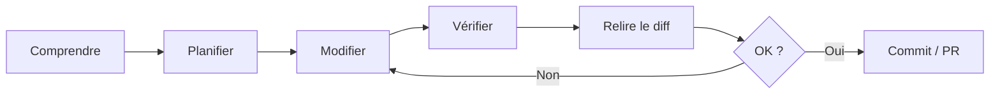

# Bonnes pratiques avec Claude Code

Claude Code est plus utile lorsqu'il reçoit un dépôt lisible, un objectif vérifiable et la possibilité d'exécuter les contrôles du projet. Ce chapitre regroupe les pratiques qui améliorent la qualité **sans augmenter inutilement l'autonomie ou le contexte**.

GitHub Copilot reste documenté comme référence : les mécanismes spécifiques Copilot ne sont pas supprimés, mais le parcours principal devient Claude Code.

---

## Les principes qui comptent le plus

| Principe | Application |
|---|---|
| **Contexte ciblé** | `CLAUDE.md` court, rules/skills à la demande |
| **Plan avant gros changement** | explorer et planifier avant d'éditer plusieurs fichiers |
| **Ground truth** | exécuter tests, build, lint, benchmarks et commandes réelles |
| **Petits diffs** | une hypothèse ou responsabilité par changement |
| **Outils minimaux** | ne donner à un agent que les capacités nécessaires |
| **Relecture du diff** | l'agent produit, le développeur reste responsable du commit |
| **Sécurité** | protéger secrets, permissions, données et systèmes externes |
| **Contexte propre** | `/clear` entre tâches indépendantes, compaction si nécessaire |

---

## Pages du chapitre

<div class="grid cards" markdown>

- :material-comment-text: **[Utilisation effective](utilisation-effective.md)**

    Choisir entre conversation, Plan, skills, subagents, MCP et vérification.

- :material-code-tags: **[Organisation du code](organisation-code.md)**

    Structurer le dépôt pour qu'un agent puisse comprendre et valider les changements.

- :material-lightning-bolt: **[Productivité](productivite.md)**

    Réduire les allers-retours, garder le contexte utile et automatiser les tâches répétitives.

- :material-shield-check: **[Sécurité & Qualité](securite-qualite.md)**

    Relecture, hallucinations, dépendances, secrets, permissions et contrôles avant commit.

- :material-speedometer: **[Performance & Ressources](performance.md)**

    Contexte, coûts, outils externes et impact des sessions longues.

- :material-routes: **[Workflows IA complets](workflows-ia.md)**

    PRD/spec → plan → implémentation → tests → review, TDD, debugging et refactoring.

</div>

---

## Un bon agent a besoin d'un bon environnement

Avant de perfectionner vos prompts, vérifiez que le dépôt fournit :

- commandes build/test/lint documentées ;
- architecture lisible ;
- conventions versionnées ;
- tests exécutables ;
- petits jeux de données ou fixtures pour reproduire les erreurs ;
- absence de secrets dans les fichiers accessibles inutilement.

Claude peut alors récupérer du **ground truth** depuis l'environnement plutôt que de produire une réponse uniquement plausible.

---

## `CLAUDE.md` : moins mais mieux

Gardez-y les informations valables pour presque toutes les sessions :

```markdown
# Project

## Commands
- Test: `pytest -q`
- Lint: `ruff check .`
- Build: `mkdocs build --strict`

## Rules
- Keep changes scoped.
- Run relevant tests before finishing.
- Never commit secrets.
- Preserve existing public behavior unless the task says otherwise.
```

Les procédures longues vont dans des **skills** ; les règles ciblées dans `.claude/rules/` ; les explorations lourdes dans des **subagents**.

---

## Boucle de travail recommandée



Cette boucle est plus importante qu'un « prompt parfait ».

---

## Copilot

Les pages historiques Copilot restent utiles pour :

- complétions inline ;
- mécanismes `.github/` ;
- comparaison des workflows ;
- environnements qui utilisent encore Copilot ;
- éventuel retour si les prix ou capacités évoluent.

Lorsqu'une fonctionnalité est strictement Copilot, elle doit être marquée comme telle au lieu d'être présentée comme générique.

---

## Sources

- [Claude Code — répertoire `.claude/`](https://code.claude.com/docs/en/claude-directory) — consulté le 2026-09-28
- [Claude Code — fonctionnalités et extensions](https://code.claude.com/docs/en/features-overview) — consulté le 2026-09-28
- [Anthropic — Building effective agents](https://www.anthropic.com/engineering/building-effective-agents) — consulté le 2026-09-28
- [Anthropic — Effective context engineering for AI agents](https://www.anthropic.com/engineering/effective-context-engineering-for-ai-agents) — consulté le 2026-09-28

## Prochaine étape

**[Utilisation effective](utilisation-effective.md)** : choisir le bon mécanisme Claude selon la tâche et structurer une session qui finit avec des preuves vérifiables.
