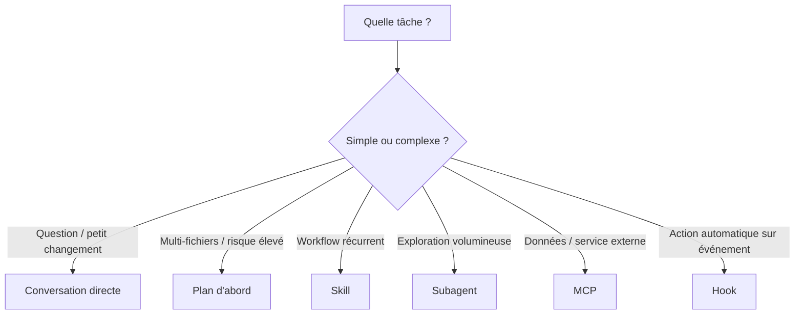

# Utilisation effective de Claude Code

<span class="badge-intermediate">Intermédiaire</span>

Claude Code n'est pas seulement un chat : il peut lire le dépôt, utiliser des outils, modifier des fichiers, exécuter des commandes et déléguer certaines recherches. L'enjeu est donc de choisir le **niveau d'autonomie** adapté à la tâche.

---

## Guide décisionnel



La bonne question n'est pas « quelle fonctionnalité est la plus puissante ? », mais « quel mécanisme donne le **moins de complexité** pour terminer cette tâche avec une preuve vérifiable ? »

---

## 1. Conversation directe

Pour une petite tâche :

```text
Corrige le bug dans @src/parser.py.
Reproduis d'abord l'échec avec le test existant.
Applique le correctif minimal.
Exécute les tests du module et résume le diff.
```

Le prompt contient :

- cible ;
- résultat attendu ;
- contrainte de scope ;
- méthode de validation.

C'est généralement plus utile qu'une longue persona.

---

## 2. Plan avant gros changement

Utilisez un mode de planification lorsqu'une tâche touche plusieurs composants ou implique une décision d'architecture.

```text
Analyse ce module et propose un plan de migration.
Avant toute modification :
- cartographie les dépendances ;
- liste les fichiers touchés ;
- identifie les risques ;
- indique les tests de non-régression ;
- sépare les étapes réversibles.
```

Validez le plan avant une migration large. Pour une tâche déjà claire et locale, ne créez pas de cérémonie inutile.

---

## 3. Contexte : référencer plutôt que recopier

Référencez les fichiers utiles et laissez Claude explorer le dépôt lorsque nécessaire.

Bon :

```text
Compare @src/services/OrderService.ts avec le pattern de @src/services/UserService.ts.
Aligne uniquement la gestion d'erreurs et ajoute les tests manquants.
```

Moins bon : coller plusieurs centaines de lignes déjà accessibles dans le dépôt.

---

## 4. Demander des critères de réussite

Une tâche agentique doit savoir quand elle est terminée.

```text
La tâche est terminée seulement si :
- les tests ciblés passent ;
- le lint du module passe ;
- aucune API publique n'a changé ;
- le diff ne contient aucun fichier généré inattendu.
```

Anthropic recommande de donner aux agents un accès au **ground truth de l'environnement** : tests, sorties d'outils, état des fichiers, résultats de commandes.

---

## 5. Skills pour les workflows récurrents

Si vous répétez la même procédure, créez un skill.

Exemple `.claude/skills/review-pr/SKILL.md` :

```markdown
---
name: review-pr
description: Revue une PR du projet avec les contrôles de qualité attendus.
---

1. Lire le diff.
2. Identifier les changements comportementaux.
3. Vérifier tests, sécurité et compatibilité.
4. Exécuter les contrôles disponibles.
5. Retourner les problèmes avec fichier/ligne et preuve.
```

Un skill réduit la répétition et rend le workflow versionnable.

---

## 6. Subagents pour isoler le bruit

Un subagent est utile lorsqu'une recherche produit beaucoup d'informations dont la conversation principale n'a besoin que sous forme de synthèse.

Exemples :

- cartographier un gros monorepo ;
- chercher toutes les utilisations d'une API ;
- auditer sécurité, performance et tests en parallèle ;
- analyser une dépendance externe.

Évitez de déléguer une petite modification locale : l'orchestration a aussi un coût.

---

## 7. MCP pour les systèmes externes

MCP est approprié si la tâche dépend de données ou actions hors dépôt :

- GitHub ;
- ticketing ;
- bases de données ;
- documentation interne ;
- observabilité.

Donnez les permissions minimales. Si vous avez seulement besoin de lire un ticket, un outil d'écriture n'est pas nécessaire.

---

## 8. Hooks pour les invariants automatiques

Les hooks peuvent lancer une vérification sur des événements Claude Code.

Bon usage :

- format/lint léger après édition ;
- empêcher certaines opérations dangereuses ;
- journaliser une action importante.

Mauvais usage : lancer une suite de tests de 30 minutes après chaque modification de fichier.

---

## 9. Hygiène de contexte

### `/clear`

Utilisez `/clear` lorsque vous passez à une tâche indépendante. Conserver une longue conversation « au cas où » augmente le bruit.

### `/compact`

Utilisez la compaction lorsqu'une tâche longue doit continuer mais que l'historique devient volumineux.

### `/rewind`

Utilisez les mécanismes de rewind/checkpoint lorsqu'un changement ou une direction de conversation doit être annulé selon les capacités de votre version Claude Code.

Gardez aussi `CLAUDE.md` court : il est chargé fréquemment et doit contenir les invariants, pas une encyclopédie.

---

## 10. Petits changements, validations fréquentes

Pattern recommandé :

```text
explorer → modifier un bloc cohérent → tester → relire → continuer
```

Plutôt que :

```text
réécrire 40 fichiers → lancer tous les tests à la fin → découvrir 17 causes possibles
```

Les petites étapes rendent les erreurs plus faciles à attribuer et à réverter.

---

## 11. Ne pas accepter une réponse comme une preuve

Signaux insuffisants :

- « cela devrait fonctionner » ;
- « la syntaxe semble correcte » ;
- « le test devrait passer » ;
- « cette API existe probablement ».

Demandez :

```text
Exécute le test.
Montre la commande et le résultat utile.
Si tu ne peux pas l'exécuter, dis exactement ce qui manque.
```

---

## 12. Copilot — référence conservée

Les mécanismes suivants restent documentés dans les chapitres Copilot :

- complétion inline ;
- slash commands Copilot ;
- variables de contexte propres à VS Code/Copilot ;
- `.github/copilot-instructions.md` ;
- `.prompt.md` et `.agent.md`.

Ne transposez pas automatiquement ces syntaxes dans Claude Code : utilisez les équivalents `CLAUDE.md`, rules, skills, subagents, hooks et MCP.

---

## Checklist d'une session efficace

- [ ] objectif et scope explicites ;
- [ ] fichiers ou zone du dépôt identifiables ;
- [ ] critères de réussite définis ;
- [ ] permissions proportionnées ;
- [ ] tests/commandes exécutés ;
- [ ] diff relu ;
- [ ] contexte nettoyé avant une nouvelle tâche indépendante.

---

## Sources

- [Claude Code — fonctionnalités et extensions](https://code.claude.com/docs/en/features-overview) — consulté le 2026-09-28
- [Claude Code — répertoire `.claude/`](https://code.claude.com/docs/en/claude-directory) — consulté le 2026-09-28
- [Anthropic — Building effective agents](https://www.anthropic.com/engineering/building-effective-agents) — consulté le 2026-09-28
- [Anthropic — Effective context engineering for AI agents](https://www.anthropic.com/engineering/effective-context-engineering-for-ai-agents) — consulté le 2026-09-28

## Prochaine étape

**[Organisation du code](organisation-code.md)** puis **[Workflows IA complets](workflows-ia.md)** pour appliquer ces principes à des changements réels de bout en bout.
