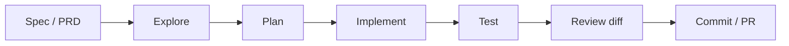
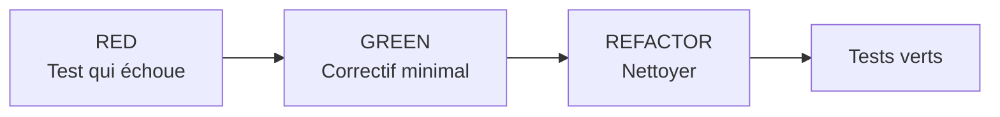

# Workflows IA complets avec Claude Code

<span class="badge-intermediate">Intermédiaire</span> <span class="badge-expert">Expert</span>

Claude Code peut accompagner tout le cycle de développement : spécification, exploration, planification, implémentation, tests, revue et documentation. L'objectif n'est pas de maximiser l'autonomie, mais de construire une **boucle contrôlée avec validations fréquentes**.

---

## Workflow 1 — Spec / PRD → Plan → Implémentation



### Étape 1 — Formaliser le besoin

```markdown
### Objectif
Informer le client après chaque transition de statut pertinente.

### Contraintes
- Node.js + TypeScript strict
- file asynchrone existante à réutiliser
- provider email déjà configuré
- pas de secret dans le code

### Critères d'acceptation
- [ ] événement déclenché une seule fois par transition
- [ ] retry borné en cas d'échec transitoire
- [ ] logs corrélables à la commande
- [ ] tests d'intégration sur les transitions critiques

### Hors périmètre
SMS et notifications marketing.
```

### Étape 2 — Explorer avant de proposer

```text
Lis cette spec et cartographie l'implémentation existante.
Trouve :
- la machine d'état de commande ;
- le système de queue ;
- le client email ;
- les patterns de tests proches.
Ne modifie rien.
```

### Étape 3 — Planifier

```text
Propose un plan en petites étapes réversibles.
Pour chaque étape : fichiers, changement, risque, test de validation.
Réutilise les abstractions existantes et signale les inconnues.
```

### Étape 4 — Implémenter par blocs

Ne demandez pas toute la feature en une seule édition. Faites terminer et tester chaque responsabilité cohérente avant la suivante.

### Étape 5 — Vérifier

```text
Exécute les tests ciblés puis les contrôles du projet pertinents.
Relis le diff par rapport à la spec et signale tout critère d'acceptation non prouvé.
```

---

## Workflow 2 — TDD assisté

Claude est particulièrement efficace lorsque le comportement attendu existe sous forme de tests.



### Red

Écrivez ou faites écrire un test qui exprime le comportement métier.

```text
Ajoute un test de régression pour le bug décrit dans l'issue.
Le test doit échouer sur le code actuel.
Exécute-le et confirme l'échec avant toute correction.
```

### Green

```text
Applique le correctif minimal pour faire passer ce test.
Ne refactore rien d'autre.
```

### Refactor

```text
Maintenant simplifie le code sans modifier le comportement public.
Exécute toute la suite ciblée après le refactor.
```

Le test avant correction réduit fortement le risque que l'agent « corrige » autre chose que le bug observé.

---

## Workflow 3 — Debugging fondé sur preuve

```text
Erreur : <stack trace>
Reproduction : <commande>
Attendu : <résultat>
Observé : <résultat>
```

Demande :

```text
1. Reproduis l'erreur.
2. Trace le chemin d'exécution pertinent.
3. Formule 1 à 3 hypothèses classées par preuve disponible.
4. Teste l'hypothèse la plus probable.
5. Ajoute un test de régression.
6. Corrige uniquement après confirmation de la cause.
```

Évitez « essaie plusieurs changements jusqu'à ce que ça marche » : cela crée des correctifs impossibles à expliquer.

---

## Workflow 4 — Refactoring progressif

Pour un refactor large :

1. figer le comportement avec des tests ;
2. cartographier les appelants ;
3. définir la cible ;
4. découper en étapes compatibles ;
5. tester après chaque étape ;
6. supprimer l'ancien chemin seulement à la fin.

```text
Je veux extraire cette logique vers un nouveau service.
Avant modification, trouve tous les appelants et tests existants.
Propose un ordre où chaque commit reste buildable.
```

Un worktree séparé peut être utile pour une exploration ou implémentation isolée lorsque la fonctionnalité Claude Code correspondante est disponible dans votre environnement.

---

## Workflow 5 — Revue de code

Une bonne revue Claude ne demande pas seulement « est-ce que ce code est bon ? ».

```text
Revois ce diff comme reviewer.
Cherche d'abord :
- changement comportemental non documenté ;
- bugs et cas limites ;
- sécurité ;
- compatibilité ;
- tests manquants ;
- complexité inutile.

Pour chaque finding : fichier/ligne, impact, preuve, correction minimale.
Ne liste pas de préférences de style déjà couvertes par le linter.
```

Pour une PR importante, des subagents séparés peuvent auditer sécurité, tests et performance, puis le contexte principal synthétise les résultats.

Donnez au reviewer le diff, les critères d'acceptation et les preuves de test, puis demandez-lui de chercher une défaillance concrète. Une revue indépendante limite les hypothèses héritées de l'implémentation. Chaque finding doit être confirmé ; l'accord de plusieurs agents ne remplace pas un test ni une preuve dans le code.

---

## Workflow 6 — Mise à jour documentation + code

```text
Compare le comportement public modifié par ce diff avec la documentation.
Identifie les pages devenues fausses.
Mets à jour uniquement celles qui sont affectées.
Vérifie les liens internes et exemples de commande touchés.
```

Une règle ou un hook peut rappeler la parité code/docs, mais l'agent doit déterminer si une page est réellement affectée avant de modifier tout le site.

---

## Workflow 7 — Dépendance / migration de version

Ne demandez pas seulement « mets à jour vers la dernière version ».

```text
Nous devons mettre à jour <dépendance>.
1. lis notre version actuelle et ses usages ;
2. consulte la documentation/changelog officiel actuel ;
3. identifie les breaking changes pertinents pour CE dépôt ;
4. propose un plan ;
5. mets à jour dépendance + code ;
6. exécute tests et build ;
7. résume les changements de comportement.
```

Les faits de version et APIs externes doivent être vérifiés sur une source actuelle.

---

## Workflow 8 — Issue → PR

Avec un connecteur GitHub/MCP autorisé, Claude peut réduire les copier-coller entre ticket et dépôt.

Séquence contrôlée :

```text
issue → reproduire → plan → code → tests → diff → PR
```

Ne donnez pas automatiquement des permissions d'écriture GitHub si la tâche consiste seulement à lire une issue.

---

## Quand utiliser un subagent

Utilisez un subagent si la sous-tâche :

- nécessite beaucoup d'exploration ;
- peut être menée indépendamment ;
- ne nécessite pas tout l'historique de la conversation ;
- peut retourner une synthèse courte.

Exemples : cartographie d'un monorepo, audit de sécurité, recherche de tests manquants.

---

## Quand utiliser un skill

Transformez un workflow en skill lorsqu'il revient régulièrement :

- revue PR ;
- préparation release ;
- migration DB ;
- audit sécurité ;
- validation documentation.

Le skill versionne la procédure et réduit la variabilité entre sessions.

---

## Definition of Done pour une tâche Claude

Une tâche n'est pas terminée parce que l'agent dit « terminé ».

Exemple :

```markdown
## Done
- [ ] comportement demandé implémenté
- [ ] tests ciblés exécutés
- [ ] build/lint pertinent exécuté
- [ ] diff relu
- [ ] docs mises à jour si nécessaire
- [ ] aucun secret / fichier généré inattendu
- [ ] limitations ou validations impossibles signalées explicitement
```

---

## Sources

- [Claude Code — vérification et revue indépendante](https://code.claude.com/docs/en/best-practices) — vérifié le 2026-10-03

- [Claude Code — fonctionnalités et extensions](https://code.claude.com/docs/en/features-overview) — consulté le 2026-09-28
- [Claude Code — common workflows](https://code.claude.com/docs/en/common-workflows) — consulté le 2026-09-28
- [Anthropic — Building effective agents](https://www.anthropic.com/engineering/building-effective-agents) — consulté le 2026-09-28
- [Anthropic — Trustworthy agents in practice](https://www.anthropic.com/research/trustworthy-agents) — consulté le 2026-09-28

---

## Référence en annexe

[Copilot — archive de ce chapitre](../appendices/copilot/chapitre-9-bonnes-pratiques.md#page-chapitre-9-bonnes-pratiques-workflows-ia).

## Prochaine étape

Poursuivez avec **[Cas d'Usage — Accueil](../chapitre-10-cas-usage/index.md)**, la page suivante dans le menu.
