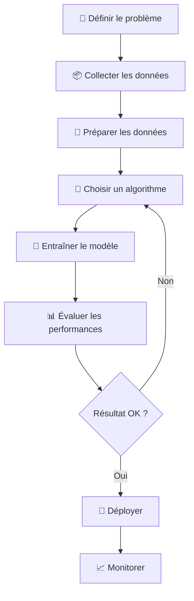

# Machine Learning avec GitHub Copilot

Intermédiaire

Ce chapitre explore le Machine Learning et le Deep Learning sous deux
angles complémentaires : comprendre les **fondamentaux théoriques**
(algorithmes, statistiques, réseaux de neurones) et utiliser **GitHub
Copilot pour accélérer** chaque étape du workflow ML — de
l'exploration des données au déploiement en production.

---

## 🤖 Parcourir ce Chapitre

- :material-brain: **Concepts Fondamentaux**

    ---

    Intelligence artificielle, Machine Learning, Deep Learning :
    définitions, historique, et les 3 types d'apprentissage.

    [Commencer ici →](concepts-fondamentaux.md)

- :material-function: **Algorithmes Courants**

    ---

    Régression, classification, clustering : panorama des grands
    algorithmes ML supervisés et non supervisés.

    [Voir les algorithmes →](algorithmes-courants.md)

- :material-robot-outline: **Copilot pour le ML**

    ---

    Comment Copilot assiste à chaque étape du workflow ML :
    définition du problème, préparation des données, entraînement,
    évaluation.

    [Découvrir le workflow →](copilot-workflow-ml.md)

- :simple-python: **Python & Data Science**

    ---

    Copilot + pandas, numpy, scikit-learn. Patterns optimaux pour
    l'exploration de données et l'entraînement de modèles.

    [Guide pratique →](python-data-science.md)

- :material-layers: **Deep Learning**

    ---

    Réseaux de neurones, perceptron, CNN. Copilot avec TensorFlow,
    Keras et PyTorch.

    [Niveau expert →](deep-learning.md)

- :simple-jupyter: **Notebooks Jupyter**

    ---

    Copilot dans les notebooks Jupyter : complétion inline,
    génération de cellules, documentation automatique.

    [Utiliser Copilot en notebook →](notebooks-jupyter.md)

- :material-rocket-launch: **MLOps & Déploiement**

    ---

    De l'expérimentation à la production : versioning de modèles,
    pipelines CI/CD ML, monitoring avec Copilot.

    [Aller en production →](mlops-deploiement.md)

- :material-scale-balance: **Comparaison Écosystèmes ML**

    ---

    Python vs R vs Julia pour le Machine Learning : forces,
    faiblesses, intégration Copilot.

    [Comparer les langages →](comparaison-ecosystemes-ml.md)

- :material-compare: **Comparaison des Outils**

    ---

    scikit-learn vs TensorFlow vs PyTorch vs Keras : quel framework
    pour quel usage ?

    [Choisir son framework →](comparaison-outils.md)

---

## Prérequis

!!! info "Ce dont tu as besoin"
        - **Python 3.10+** installé sur ton poste
        - **GitHub Copilot** activé dans VS Code ou IntelliJ IDEA
        - Notions de base en Python (variables, fonctions, listes) — voir
            [chapitre 2 du livre de référence](../chapitre-7-cas-usage/python.md)
        - Aucune compétence mathématique avancée requise pour les
            fondamentaux

---

## Vision d'Ensemble

!!! tip "Copilot à chaque étape"
    GitHub Copilot peut assister à **toutes** les étapes de ce
    workflow : génération de code de nettoyage de données,
    suggestions d'algorithmes, écriture de pipelines d'entraînement,
    création de tests de modèle, et même scripts de déploiement.

---

## Ressources du Chapitre

| Page | Niveau | Thème |
|------|--------|-------|
| [Concepts Fondamentaux](concepts-fondamentaux.md) | Débutant | IA, ML, DL, types d'apprentissage |
| [Algorithmes Courants](algorithmes-courants.md) | Intermédiaire | Régression, classification, clustering |
| [Copilot pour le ML](copilot-workflow-ml.md) | Intermédiaire | Workflow ML assisté par Copilot |
| [Python & Data Science](python-data-science.md) | Intermédiaire | pandas, numpy, scikit-learn |
| [Deep Learning](deep-learning.md) | Expert | Réseaux neurones, TensorFlow, PyTorch |
| [Notebooks Jupyter](notebooks-jupyter.md) | Intermédiaire | Copilot dans Jupyter |
| [MLOps & Déploiement](mlops-deploiement.md) | Expert | CI/CD ML, monitoring |
| [Comparaison Écosystèmes ML](comparaison-ecosystemes-ml.md) | Intermédiaire | Python vs R vs Julia |
| [Comparaison des Outils](comparaison-outils.md) | Intermédiaire | sklearn vs TF vs PyTorch |
